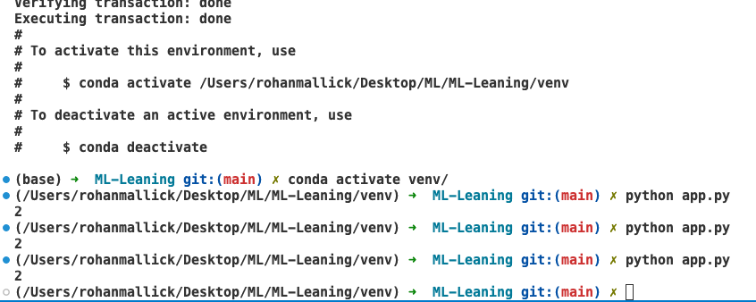

# ML-Leaning
This Repo dedicated to my ML learning journey!

Installation

## Create Conda Virtual Enviornment

`conda create -p venv python==3.12`
# Activate the env

`conda activate venv/1`

# Run Python Code
`python app.py`

## Install Jupyter Notebook Kernel in VS Code
`pip install ipykernel`

## Requirement.txt
This is the package manager like package.json in node. You can write any package required for you work and simply execute below command to install them.
`pip install -r requirements.txt`